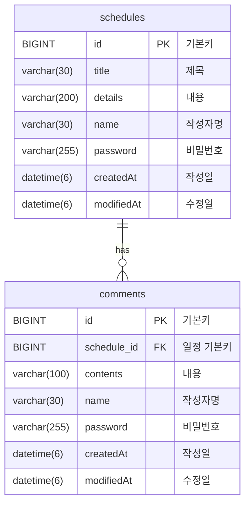

# spartan-scheduler
<!-- ERD -->
## ERD

```mermaid
erDiagram
    schedules ||--o{ comments : has

    schedules {
        BIGINT id PK "기본키"
        varchar(30) title "제목"
        varchar(200) details "내용"
        varchar(30) name "작성자명"
        varchar(255) password "비밀번호"
        datetime(6) createdAt "작성일"
        datetime(6) modifiedAt "수정일"
    }

    comments {
        BIGINT id PK "기본키"
        BIGINT schedule_id FK "일정 기본키" 
        varchar(100) contents "내용"
        varchar(30) name "작성자명"
        varchar(255) password "비밀번호"
        datetime(6) createdAt "작성일"
        datetime(6) modifiedAt "수정일"
    }
```
