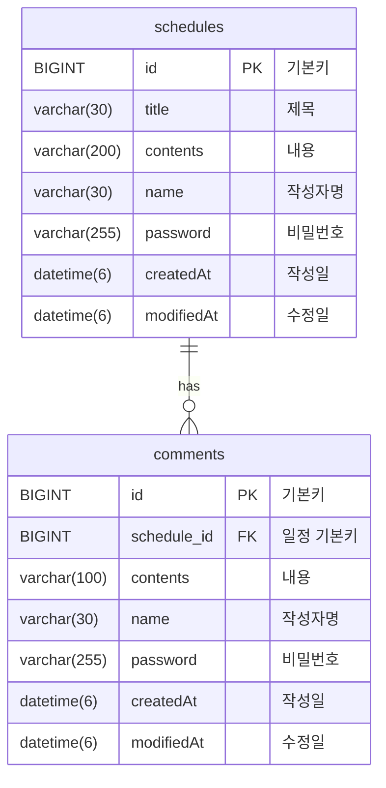

# spartan-scheduler
<!-- API 명세서 -->
## API 명세서

### 일정 생성(일정 작성하기)
Request 
|Method|URL|Content-Type|
|:-:|:-:|:-:|
|POST|schedules|application/json|
* Body:
  ```json
  {
	"title": "생일",
	"contents": "오늘은 생일이다",
	"name": "류호정",
	"password": "1234"
  }
  ```
Response 
* Status Code: 201(생성 성공)
* Body:
  ```json
  {
    "id": 1,
    "title": "생일",
    "contents": "오늘은 생일이다",
    "name": "류호정",
    "createdAt": "2026-02-03T18:22:04.1486554",
    "modifiedAt": "2026-02-03T18:22:04.1486554"
  }
  ```
* Status Code: 400(실패)
* Body:
  ```json
  {
    "isOk": false,
    "message": "title을 30 이하로 입력해 주세요"
  }
  ```
### 전체 일정 조회
Request 
|Method|URL|Content-Type|
|:-:|:-:|:-:|
|GET|schedules|application/json|

Response 
Status Code: 200(성공)
* Body:
  ```json
  [
    {
        "id": 1,
        "title": "생일",
        "contents": "오늘은 생일이다",
        "name": "류호정",
        "createdAt": "2026-01-30T17:10:31.360658",
        "modifiedAt": "2026-02-02T13:03:28.874428"
    },
    {
        "id": 2,
        "title": "생일",
        "contents": "오늘은 생일이다",
        "name": "류호정",
        "createdAt": "2026-01-30T17:10:44.51915",
        "modifiedAt": "2026-01-30T17:10:44.51915"
    }
  ]
  ```
### 선택 일정 조회
Request 
|Method|URL|Content-Type|PathVariable|
|:-:|:-:|:-:|:-:|
|GET|schedules/{id}|application/json|id|

Response 
Status Code: 200(성공)
* Body:
  ```json
  {
    "id": 1,
    "title": "생일",
    "contents": "오늘은 생일이다",
    "name": "류호정",
    "comments": [
        {
            "id": 3,
            "contents": "축하한다",
            "name": "엄마",
            "scheduleId": 30,
            "createdAt": "2026-02-02T15:20:44.07406",
            "modifiedAt": "2026-02-02T15:20:44.07406"
        },
        {
            "id": 4,
            "contents": "고맙다",
            "name": "아빠",
            "scheduleId": 30,
            "createdAt": "2026-02-02T15:20:51.237276",
            "modifiedAt": "2026-02-02T15:20:51.237276"
        }
    ],
    "createdAt": "2026-01-30T17:10:44.51915",
    "modifiedAt": "2026-01-30T17:10:44.51915"
  }
  ```
### 선택한 일정 수정
Request 
|Method|URL|Content-Type|PathVariable|
|:-:|:-:|:-:|:-:|
|PATCH|schedules/{id}|application/json|id|
* Body:
  ```json
  {
	"title": "운동가는 날",
	"contents": "오늘은 생일이다",
	"password": "1234"
  }
  ```
Response 
* Status Code: 200(성공)
* Body:
  ```json
  {
    "id": 2,
    "title": "운동가는 날",
    "contents": "오늘은 생일이다",
    "name": "블루",
    "createdAt": "2026-02-03T18:22:04.1486554",
    "modifiedAt": "2026-02-03T18:22:04.1486554"
  }
  ```
* Status Code: 400(실패)
* Body:
  ```json
  {
    "isOk": false,
    "message": "title을 30 이하로 입력해 주세요"
  }
  ```
### 선택한 일정 삭제
Request 
|Method|URL|Content-Type|PathVariable|
|:-:|:-:|:-:|:-:|
|DELETE|schedules/{id}|application/json|id|
* Body:
  ```json
  {
	"password": "1234"
  }
  ```
Response 
* Status Code: 204(성공)

<p align="right">(<a href="#readme-top">back to top</a>)</p>
<!-- ERD -->
## ERD



<p align="right">(<a href="#readme-top">back to top</a>)</p>
